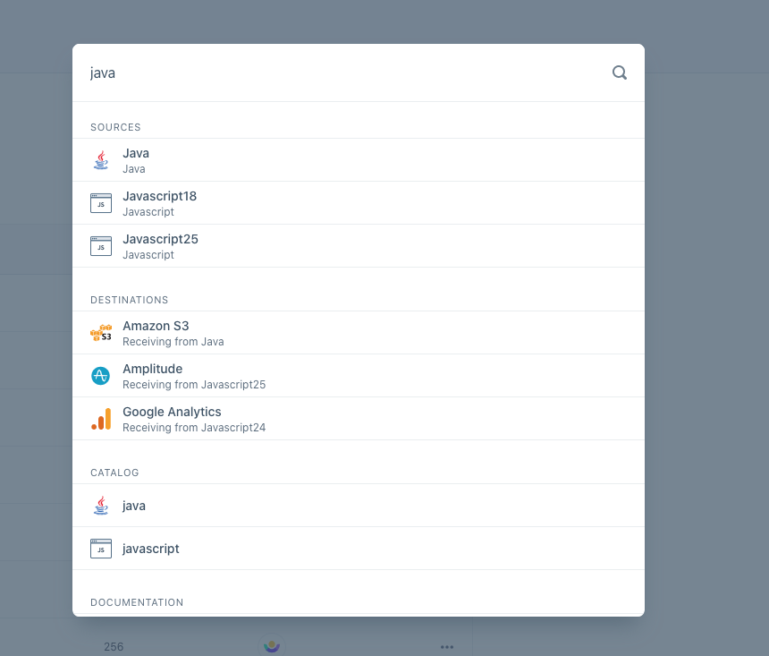

# Segment UX Engineer Autocomplete

We have a scaffolded repo locally that's spun up using [Create React App](https://reactjs.org/docs/create-a-new-react-app.html), [Evergreen](https://evergreen.segment.com/), and [Typescript](https://www.typescriptlang.org/).

We're going to be building an autocomplete UI that lets users search various entities across their workspace. You've been given the following mock to go off of:



Your starting point for building out this UI component is in `components/Search.tsx`. You can use the data-fetching hook in `hooks/use-query.ts` to populate your component with some mock data (and simulated latency, as if you were fetching from a real API).

We'd like to build this UI component with the following requirements in mind:

- The UI should fetch and display grouped data that comes back from the API
- The UI is performant, and doesn't put too much load on our backend systems.
- The Search component is easily extensible and modular.
- We should have an appropriate empty state for a 0 result set from our API.
- The Search component should be resilient to things like network error, user error, etc.

You are free to use any documentation at your disposal (Evergreen docs, React docs, MDN, etc) for this question.

## Get started

```
# Install yarn: https://yarnpkg.com/en/docs/install

$ yarn
$ yarn start

# Or if you have NPM

$ npm i
$ npm start
```
